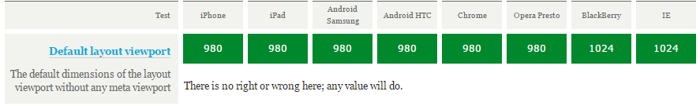
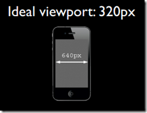
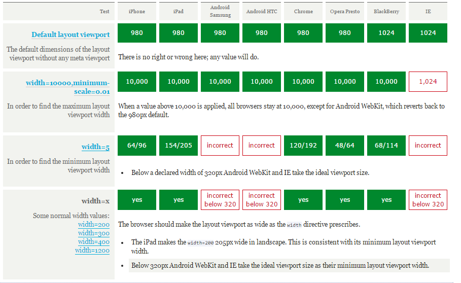
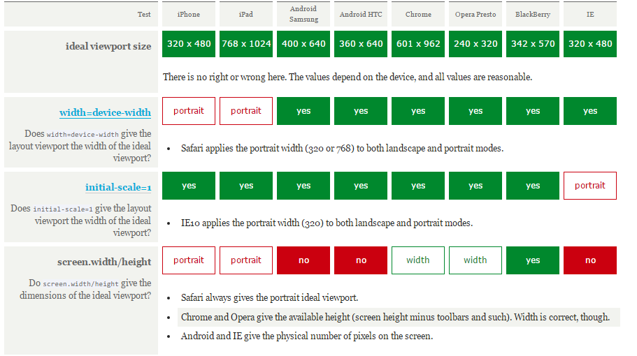
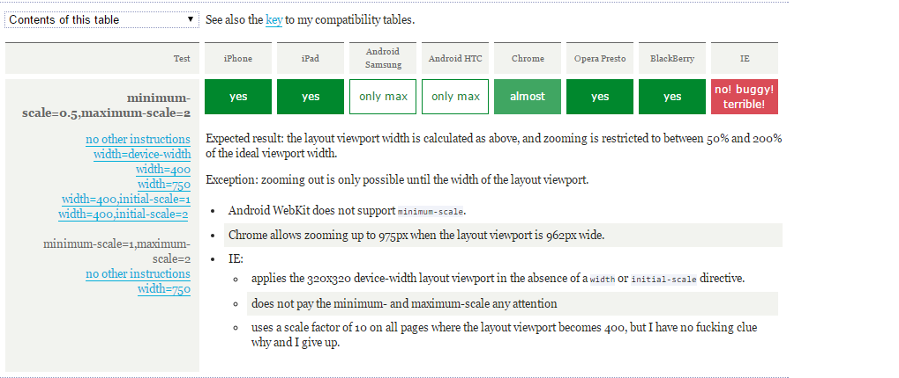
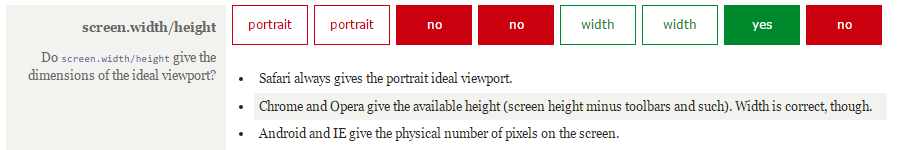

## 移动适配的解决方案
### perfect viewport解决方案

>PPK大神提出三种viewport: 
> - layout viewport
> - visual viewport
> - ideal viewport


#### 什么是viewport
> CSS中没有任何宽度声明时，每个块级元素的默认宽度都为100%。

- **相对于什么的100%呢？**
每一个CSS宽度的百分比都是根据它的父元素的宽度来计算的，所以元素的宽度为父元素的宽度的100%。
- **html的包含块（viewport）**
在CSS标准文档中，viewport被称为`初始包含块`（initial containing block）。这个初始包含块是所有CSS百分比宽度推算的根源，它给CSS布局限制了一个最大宽度。

** 在PC端，viewport的宽度和浏览器窗口的宽度一致。如果不管`margin`和`padding`，那么`html`和`body`元素也都与浏览器窗口的宽度一致。 **

- 在mobile上，如果viewport的宽度和浏览窗口的宽一致，效果怎么样？（就PC网站移到mobile上而言）
**体验很差：**因为有些移动端的浏览器会对没有mobile-optimised网站尽可能地缩小来让用户看到网站的全貌，易读性很差。而对于flow layout的网站，通常会被挤压在一起。
**解决方法：**针对移动端出特定的设计稿（H5）

viewport太窄了，以至于不能正常展示你的CSS布局。解决方案是使viewport变宽一些。需要将其分为成：`layout viewport`和`visual viewport`。
#### layout viewport
layout viewport——在页面渲染之前，浏览器是需要知道`layout viewport`的宽度，CSS布局会根据它来计算，并被它约束，如`width: 20%`。它与浏览器屏幕宽不再相关联，而是完全独立的。而且它很好地解决了将PC网站移到mobile上的问题。

为了能在移动设备上正常显示传统桌面端的页面，移动浏览器厂商们都为`layout viewport`设定默认宽度（没有标准，自定制）,一般默认`layout viewport`的宽度远大于屏幕的宽度：

**注意：默认值只在没有meta viewport声明时才会生效**(因为可以通过meta来修改`layout viewport`)
说完`layout viewport`，那什么是`visual viewport`？它有什么特性，与`layout viewport`有什么不同呢？
#### visual viewport
`layout viewport`的默认宽度远大于屏幕宽度，加上CSS布局是根据`layout viewport`来渲染的。也就是说，某些情况用户只能看见页面的某个部分，而不是全部。而`visual viewport`决定了页面的可见区域，该区域是用户能看见的。

可以通过缩放来修改`visual viewport`,但缩放不会影响`layout viewport`。

#### ideal viewport
默认情况下，`layout viewport`默认宽度并不是一个理想的宽度，虽然它能让桌面网站页面不被压扁，但并不理想。这就是Apple和其他仿效Apple的浏览器厂商引入`ideal viewport`（即viewport meta，注意浏览器是不支持该标签的，因为没有`ideal viewport`）概念的原因——显示在`ideal viewport`中的网站拥有最理想的浏览和阅读的宽度，不会出现横向滚动条，不需要用户手动缩放，就可以完美地呈现给用户。`ideal viewport`对设备来说是最理想的视口布局尺寸。
#### 如何设置`ideal viewport`
>如果没有meta viewport标签声明，那么`layout viewport`将会维持它的默认宽度。

所以一般情况下，设置`ideal viewport`只是针对为H5设计稿。当在页面中添加如下代码，`ideal viewport`就会是生效：

`<meta name="viewport" content="width=device-width">`

上述代码会将`layout viewport`的宽度设置为理想视口的宽度。定义`ideal viewport`是浏览器的工作，而不是设备或操作系统的工作。因此同一设备不同浏览器拥有不同的`ideal viewport`,虽然`ideal viewport`是有浏览器定义的，但是`ideal viewport`的大小还是受设备约束的。[更多测试数据](http://www.quirksmode.org/mobile/metaviewport/devices.html)

##### meta viewport的解释
`meta viewport`标签应该被放在HMTL文档的`<head>`中，书写格式如下：
`<meta name="viewport" content="name=value,name=value">`
每一个`name=value`都是一个给浏览器发号命令的指令，以`,`逗号分隔，共有5个：

- width：设置`layout viewport`的宽度，为一个正整数，或字符串`width-device`
- initial-scale：设置页面的初始缩放值，为一个数字，可以带小数
- minimum-scale：允许用户的最小缩放值，为一个数字，可以带小数
- maximum-scale：允许用户的最大缩放值，为一个数字，可以带小数
- height：设置`layout viewport`的高度，这个属性对我们并不重要，很少使用
- user-scalable：是否允许用户进行缩放，值为`no`或`yes`, `no`代表不允许，`yes`代表允许

###### width
- `device-width`
通常情况下希望，当设备进行旋转时，`ideal viewport`进行响应，即浏览器会根据设备的旋转来调整`ideal viwport`，横屏的`ideal viewport`宽度大于竖屏的。但是iOS中的Safari总是保持竖屏的`ideal viewport`的宽度（iphone:320px, ipad:768px）。PPK猜想Apple这么做的原因是为了避免`layout viewport`的宽度改变导致页面reflow或repaint。 reflow或repaint会影响性能。
- width=width
可以为`width`指定一个整数值。浏览器支持最大值是10000px，最小值约为`ideal viewport`的20%。android webkit不允许任何小于`layout viewport`的宽度。如小于则转为默认`layout viewport`宽度。而IE10不允许超出480px，超出则转为默认`layout viewport`宽度。
[](http://www.quirksmode.org/mobile/metaviewport/)

###### initial-scale

**pixel**

- 设备像素（device pixels）：设备屏幕的物理像素，任何设备的物理像素的数量都是固定的
- CSS像素（CSS pixels）：CSS像素是一个抽像的单位，主要使用在浏览器上，用来精确度量Web页面上的内容。一般情况之下，CSS像素称为与设备无关的像素(device-independent pixel)，简称DIPs。

100%缩放：上层是CSS像素，下层是设备像素（缩放操作的是CSS像素，而不是设备像素）

缩小：

放大

- 屏幕密度是指一个设备表面上存在的像素数量，它通常以每英寸有多少像素来计算(PPI)。
- 设备像素比（device pixel ratio）
设备像素比简称为dpr，其定义了物理像素和设备独立像素的对应关系：
`设备像素比 ＝ 物理像素 / 设备独立像素`
或设备像素个数和`ideal viewport`的比。


++一个CSS像素相当于多少设备像素取决于屏幕的特性（密度）和缩放程度++

**zoom**

zoom是一个放大或缩小CSS像素的过程。
缩放会影响是viewport的尺寸，放大会使得viewport变得更小，屏幕上显示的CSS像素更少，反之则。而这里的viewport对桌面和手机代表有所不同，在mobile上代表的是`visual viewport`,而`layout viewport`不会被缩放影响。但在桌面上代表的是`visual viewport`和`layout viewport`，因为两者是相同的，不可能只改变其中一个而另一个不变。因此就上所述而言，mobile上的`visual viewport`与`zoom factor`存在逆相关关系：放得越大，`visual viewport`就越小。如下公式：
`visual viewport width = ideal viewport width / zoom factor`
`zoom factor = ideal viewport width / visual viewport width`


`initial-scale`指令设置页面的初始缩放因子（zoom factor）。1代表100%，2代表200%，以此类推。而缩放因子是根据`ideal viewport`来计算的。

当设置了`initial-scale`指令时，实际上做了两件事：

- 浏览器会将缩放因子相对于`ideal viewport`计算出`visual viewport`的宽度。
- 将`layout viewport`的宽设置为`visual viewport`的宽。

如下结论：会将`layout viewport`设置为`ideal viewport`，效果与`width=device-width`相同，也就说：
`<meta name="viewport" content="initial-scale=1">` 与 `<meta name="viewport" content="width=device-width">`效果是等同的。

#### perfect meta viewport
当设置`initial-scale=1`时，Safari上的`ideal viewport`的尺寸会响应屏幕的旋转。如iphone5，竖屏模式下为320px，横屏模式为568px；解决了iOS中的Safari在`width=device-width`总保持竖屏模式下的`ideal viewport`的宽的bug。而IE10有着完全相反的问题：`initial-scale=1`在横屏模式下`ideal viewport`宽度总保持竖屏`ideal viewport`的宽。但是`width=device-width`时，就恢复正常了。

因此，为了解决`ideal viewport`横竖屏的响应问题，通常我们使用如方法：
`<meta name="viewport" content="initial-scale=1,width=device-width">`
现在Safari和IE的问题都解决了，这就是`perfect meta viewport`
如果想要兼容IE，需要添加如下CSS代码：
```xml
@-ms-viewport{
	width: device-width;
}
```
因为IE只在手机上支持meta视口标签，而在平板上不支持。而且由于Microsoft希望向iPhone靠拢，总是使用320px作为理想视口的宽度。当使用`@-ms-viewport`时，IE会使用它真正符合设备尺寸的`ideal viewport`。其实`@-ms-viewport`重写了meta标签，所以同时使用meta和`@-ms-viewport`可以保证IE使用真正的`iedeal viewport`。(`@viewport`是opera提出的，在Presto中)
#### question
`<meta name="viewport" content="initial-scale=1,width=400">`如何设置`layout viewport`的宽？
答：取最大值


###### minimum-scale和maximum-scale
`minimum-scale`和`maximum-scale`可以设置缩放程度的最小值和最大值，与`initial-scale`一样，它们也是根据`ideal viewport`来计算的
浏览器默认缩放级别5（20%-500%），有这些指令时可扩大到10（10%-1000%）。

[demo参考](http://www.quirksmode.org/mobile/viewports/)

### javascript
- `layout viewport`:`document.documentElement.clientWidth/Height`，被普遍支持。

- `visual viewport`:` window.innerWidth/Height`，解决普遍支持。

- `ideal viewport`: `screen.width/height`，存在严重的浏览器兼容性问题

`screen.width/height`，根据浏览器情况，会两种值：
1. `ideal viewport`的尺寸(这个是正确的)
2. 屏幕的设备像素尺寸


[overview](http://www.quirksmode.org/mobile/overview.html)
[more](http://www.quirksmode.org/mobile/viewports2.html)


